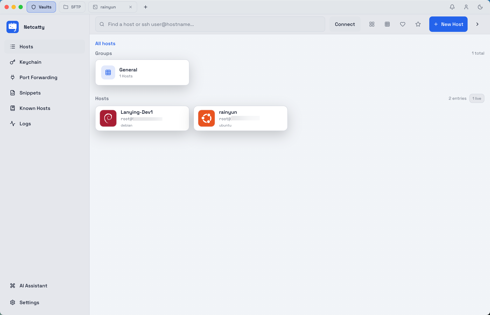

# Netcatty — SSH workspace, SFTP, and terminals in one

[](screenshot.png)

Netcatty is a modern SSH manager and terminal app that brings host grouping, drag-to-organize, SFTP side panel, keychain, port forwarding, and a rich UI theme. It ships with an xterm.js-based terminal and an Electron desktop bridge for native SSH/SFTP.

---

## Highlights
- 🧭 **Host groups & breadcrumbs**: right-click to create/delete groups, drag hosts or groups into target groups, double-click to drill into a group, and breadcrumb navigation back to root.
- 🗂️ **SFTP panel**: collapsible sidebar, single-click to enter directories, upload/delete/download, and loading animations.
- 🗝️ **Keychain**: import/generate SSH keys, choose password/key auth; single-click a host to connect.
- 🖥️ **Terminal UX**: xterm.js engine, auto-resize on window changes, connection logs, timeout/cancel, and connection progress UI.
- 🌗 **Themes & branding**: light/dark toggle, custom accent color, Netcatty logo baked in.
- 🔌 **Electron bridge**: native SSH/SFTP channels without extra browser plugins.

## Getting Started
```bash
# install dependencies
npm install
# dev mode (Vite + Electron)
npm run dev
```

### Key paths
- Web entry: `index.html` / `App.tsx`
- Terminal: `components/Terminal.tsx`
- SFTP: `components/SFTPPanel.tsx`
- Keychain: `components/KeyManager.tsx`
- Electron main: `electron/main.cjs`

## Core Workflows
- **Create a host**: click “New Host”, fill address/port/username, pick password or key; supports group path.
- **Organize groups**: right-click to create/delete, drag groups to become subgroups, drag hosts into groups, and use breadcrumbs to navigate.
- **SFTP**: after connect, open SFTP, single-click into dirs, upload/download/delete, with loading spinner and animated sidebar.
- **Keychain**: import/generate SSH keys; single-click a host to connect with the chosen auth method.

## Scripts
- `npm run dev`: Vite frontend + Electron dev.
- `npm run build`: build frontend (Electron packaging configurable).

## License
MIT
